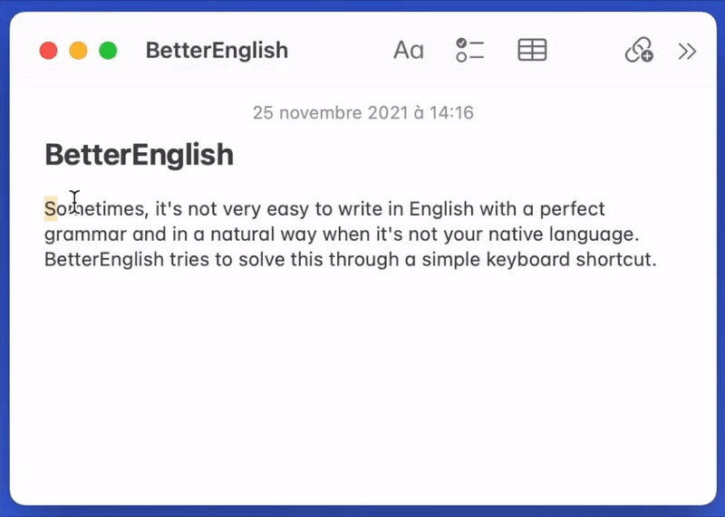

  

 

# BetterEnglish *using DeepL API*

The goal of this project is to create a quick shortcut for macOS, to select a sentence in English and paste a corrected version.
The correction is very advanced and uses [DeepL API](https://www.deepl.com/docs-api/). The correction process starts with the shortcut ⌃⌥B after selecting or copying a sentence.

  

## Configuration
* Sign-up for [DeepL API](https://www.deepl.com/docs-api/) to get your API key (for free).
* Modify the `credentials.json` file inside the `BetterEnglish` folder to add your own API key (if you use DeepL Pro, you will also need to change the URL).
* Move the folder `BetterEnglish` where you want to, for example `/Users/YOUR_USERNAME/Public/Drop Box`.
* Add the shortcut [by clicking this link](https://www.icloud.com/shortcuts/d69408715bf748b1839a3727a1772aa1) on your Mac. When prompted, provide the previously set path to the `BetterEnglish` folder.

You are now ready to go! To use this program, simply select or copy a text in English. Then press your keyboard shortcut ⌃⌥B, and paste the corrected result!
