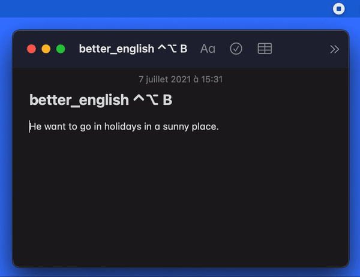

# BetterEnglish *using DeepL API*

The goal of this project is to create a quick shortcut for macOS, to copy a sentence in English and paste a corrected version.
The correction is very advanced and uses [DeepL API](https://www.deepl.com/docs-api/). The correction process starts with the shortcut ⌃⌥B after copying the sentence.



## Configuration
* Sign-up for [DeepL API](https://www.deepl.com/docs-api/) to get your API key (for free).
* Create a `credentials.json` file with the following structure and your own API key (if you use DeepL Pro, you will also need to change the URL):
```json
  {
      "apiKey": "   ",
      "url": "https://api-free.deepl.com/v2/translate"
  }
```
* Place `autocorrect_terminal.py` and `credentials.json` in a folder named `better_english`, and move it to `/Users/your_username/Public/Drop Box`.
The file `autocorrect_test.py` does not need to be in this folder, you can use it for testing purposes in a Python IDE.
* Open `better_english.workflow` with Automator and change in the shell script the line `cd "/Users/hugoqueinnec/Public/Drop Box/better_english"` to `cd "/Users/your_username/Public/Drop Box/better_english"`. Alternatively, you can open `better_english.workflow` as a folder in an IDE and make this change at the line 140 of `better_english.workflow>Contents>document.wflow`.
* cd "/Users/hugoqueinnec/Public/Drop Box/better_english"
* Place the file `better_english.workflow` in `~/Library/Services`. This will be used for the keyboard shortcut.
* Finally, go to `System Preferences>Keyboard>Shortcuts` on your Mac. Select App Shortcuts on the left, click the Add button.
In the Menu Title field, type `better_english`. Then in the Keyboard Shortcut field, press the key combination that you want to use as the keyboard shortcut (for example ⌃⌥B) , then click Add.

You are now ready to go! To use this program, simply copy a text in English. Then press your keyboard shortcut (preferably outside the text field), and paste the corrected result!
